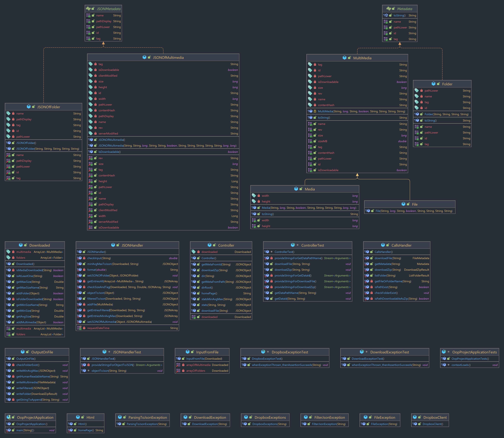

# Progetto Corso POO


## Indice  :bookmark:

* [Introduzione](#introduzione)
* [Rotte](#rotte)
* [Rotte POST](#rotte-post)
* [Rotte GET](#rotte-get)
* [Schema Classi](#schema-classi)
* [Tecnologie utilizzate](#tecnologie-utilizzate)
* [Autori](#autori)


<a name="introduzione"></a>

## Introduzione :blue_book:


L'applicazione SpringBoot qui pubblicata permette di scaricare file dal proprio account Dropbox ed effettuare,
statistiche su di essi, mediante l'utilizzo della [Dropbox Api V2](https://www.dropbox.com/developers/documentation/http/overview).

L'obiettivo principale è quello di scaricare una cartella o un file dal proprio Dropbox ed effettuare
statistiche in locale sui file scaricati in base alla dimensione e al tipo, con l'implementazione di
filtri che permettano di visualizzare solo ciò di cui  
si ha bisogno, specificando dimensione minima o
massima e tipo di file.

**Funzioni dell'applicazione**:

* Elenco cartelle del proprio account.
* Ottenere informazioni di un file o di una cartella mediante il suo percorso o id univoco.
* Download di file singoli o cartelle.
* Ottenere statistiche riguardo i file scaricati(**nome, tipo, dimensione**).
* Filtrare i file scaricati in base alla dimensione.

<a name="rotte"></a>

## Rotte :globe_with_meridians:

| Tipo     | Rotta                                         | Descrizione                                                                       | Parametri       |
|----------|-----------------------------------------------|-----------------------------------------------------------------------------------|-----------------|
|          | `/`                                           | Homepage dell'applicazione.                                                       |                 |
| ` post ` | [`/dirRoot`](#/dirRoot)                       | Restituisce l'elenco dei file e delle cartelle presenti nella root.               |                 |
| ` post ` | [`/dir`](#/dir)                               | Restituisce l'elenco dei file e delle cartelle presenti nel percorso specificato. | `path`          |
| ` post ` | [`/getMetaFromId`](#/getMetaFromId)           | Restituisce informazioni sul file o la cartella con il loro id.                   | `id`            |
| ` post ` | [`/getMetaFromPath`](#/getMetaFromPath)       | Restituisce informazioni sul file o la cartella con il loro percorso.             | `path`          |
| ` post ` | [`/downloadFile`](#/downloadFile)             | Effettua il download di un file.                                                  | `path`          |
| ` post ` | [`/downloadZip`](#/downloadZip)               | Effettua il download di una cartella.                                             | `path`          |
| ` get `  | [`/stats`](#/stats)                           | Restituisce la lista dei file scaricati.                                          | `filter`, `tag` |
| ` get `  | [`/stats/getMinAvgMax`](#/stats/getMinAvgMax) | Calcola dimensione minima, media e massima per tipo di file scaricato.            | `tag`           |

<a name="rotte-post"></a>

## Rotte POST :arrow_down:

<a name="/dirRoot"></a>

### /dirRoot

#### Chiamata su Postman

  
La chiamata `/dirRoot` restituisce l'elenco di tutti i file e le cartelle presenti nella root, in risposta otteniamo un
JSON di questo tipo:

```json
{
  "cursor": "AAEEKYBhmJJ-LYnGvDc3jclRaVZq8enDa2tlYrDug4eFfYPxaVzeVR_IkuiHz6KxbpdMEXmK5_yJlEIRuE3mtZnFqf9DTTNkLC1HRcU2wZDHj7udYh2TMY4cwYUHImoeqk7UXuMRhey92Dbrnk3YOon19YnGK1QwJdwZYvYEFt8tUa2oIK4Ar6szKpkWAjxO4sQ",
  "entries": [
    {
      "path_display": "/Images",
      "path_lower": "/images",
      "name": "Images",
      ".tag": "folder",
      "id": "id:DsnniHqkdCgAAAAAAAAABg"
    },
    {
      "path_display": "/Videos",
      "path_lower": "/videos",
      "name": "Videos",
      ".tag": "folder",
      "id": "id:DsnniHqkdCgAAAAAAAAACA"
    },
    {
      "path_display": "/Documents",
      "path_lower": "/documents",
      "name": "Documents",
      ".tag": "folder",
      "id": "id:DsnniHqkdCgAAAAAAAAACQ"
    }
  ],
  "has_more": false
}
```

<a name="/dir"></a>

### /dir

#### Chiamata su Postman


La chiamata `dir` richiede un parametro chiamato `path` da specificare nella chiamata su postman, nell'immagine sopra il
valore assegnato a path è `/Videos`, ma può essere una qualsiasi cartella, purché sia preceduta da `/`.

| Parametro | Valore              |
|-----------|---------------------|
| `path`    | Percorso desiderato |  

In risposta otterremo un JSON del tipo:

```json
{
  "cursor": "AAFEWvPQ9tXYCLKWmvHiJVQjCgOAjNiUOO1_1xet3FxG_qA-kyXDsf1guaASjAK68CY6Ks68ezHHEYgMP-bqyGasKTx0qMwPkHuolBvpCFZZzuPWF24HyPFYnlFWu2gM_lJeMbRWIL4UxqpP68uxUQAeCRubN9hOGw3-Ca2GjlKv4ZCD5tI_A04PvnUGu1zXLp8HwpJ_-96IepeCqb75J229",
  "entries": [
    {
      "path_display": "/Videos/SampleVideo_1280x720_1mb.mp4",
      "rev": "5d26839caffbe88ff28e1",
      "size": 1055736,
      "server_modified": "2021-12-05T15:59:31Z",
      "path_lower": "/videos/samplevideo_1280x720_1mb.mp4",
      "is_downloadable": true,
      "name": "SampleVideo_1280x720_1mb.mp4",
      ".tag": "file",
      "id": "id:DsnniHqkdCgAAAAAAAAACg",
      "content_hash": "ed0ebb2c4adf69e7de672bee38a637e28d2f02fd16791cef178cd74163039956",
      "client_modified": "2021-12-05T15:59:31Z"
    },
    {
      "path_display": "/Videos/SampleVideo_1280x720_10mb.mp4",
      "rev": "5d2683d642b6588ff28e1",
      "size": 10498677,
      "server_modified": "2021-12-05T16:00:31Z",
      "path_lower": "/videos/samplevideo_1280x720_10mb.mp4",
      "is_downloadable": true,
      "name": "SampleVideo_1280x720_10mb.mp4",
      ".tag": "file",
      "id": "id:DsnniHqkdCgAAAAAAAAACw",
      "content_hash": "888d65903075b907ee389f7b5c3fdf9f3865727df94191de6e2a45da916f3745",
      "client_modified": "2021-12-05T16:00:31Z"
    },
    {
      "path_display": "/Videos/SampleVideo_1280x720_20mb.mp4",
      "rev": "5d2683fab6da988ff28e1",
      "size": 21069678,
      "server_modified": "2021-12-05T16:01:10Z",
      "path_lower": "/videos/samplevideo_1280x720_20mb.mp4",
      "is_downloadable": true,
      "name": "SampleVideo_1280x720_20mb.mp4",
      ".tag": "file",
      "id": "id:DsnniHqkdCgAAAAAAAAADQ",
      "content_hash": "60df9ae5a6ae0d6b519804d61c43acecafe90a95f4c892f6001972ad122d83c1",
      "client_modified": "2021-12-05T16:01:10Z"
    }
  ],
  "has_more": false
}
```

<a name="/getMetaFromId"></a>

### /getMetaFromId

#### Chiamata su Postman


La chiamata `/getMetaFromId` prende come parametro `id` e il suo valore corrisponde all'id univoco del percorso o file
di cui vogliamo ottenere informazioni, l'id nella foto è `DsnniHqkdCgAAAAAAAAACQ`.

| Parametro | Valore        |
|-----------|---------------|
| `id`      | Id desiderato |  

In risposta otteniamo un JSON di questo formato:

```json
{
  "path_display": "/Documents",
  "path_lower": "/documents",
  "name": "Documents",
  ".tag": "folder",
  "id": "id:DsnniHqkdCgAAAAAAAAACQ"
}
``` 

<a name="/getMetaFromPath"></a>

### /getMetaFromPath

#### Chiamata su Postman


La chiamata `getMetaFromPath` prende come parametro `path` e il suo valore corrisponde al percorso o file di cui
vogliamo ottenere informazioni, nella foto `/Images/Parrots.jpg`.

| Parametro | Valore              |
|-----------|---------------------|
| `path`    | Percorso desiderato |

In risposta otteniamo un JSON di questo formato:

```json
{
  "path_display": "/Images/Parrots.jpg",
  "rev": "5d2681c657bb288ff28e1",
  "size": 36454,
  "server_modified": "2021-12-05T15:51:18Z",
  "path_lower": "/images/parrots.jpg",
  "is_downloadable": true,
  "name": "Parrots.jpg",
  ".tag": "file",
  "id": "id:DsnniHqkdCgAAAAAAAAABw",
  "content_hash": "ae63e1a2e4b219e765921f0e5ee2fa32d3f87f55e1eed36b67688ddffc820d2c",
  "client_modified": "2021-12-05T15:51:18Z"
}
```

<a name="/downloadFile"></a>

### /downloadFile

#### Chiamata su Postman


La chiamata `/downloadFile` prende come parametro `path` e il suo valore corrisponde al percorso del file che si vuole
scaricare, nella foto `/Images/Parrots.jpg`.

In risposta otteniamo un JSON di questo formato:

```json
{
  "path_display": "/Images/Parrots.jpg",
  "rev": "5d2681c657bb288ff28e1",
  "media_info": {
    "metadata": {
      ".tag": "photo",
      "dimensions": {
        "width": 612,
        "height": 408
      }
    },
    ".tag": "metadata"
  },
  "size": 36454,
  "server_modified": "2021-12-05T15:51:18Z",
  "path_lower": "/images/parrots.jpg",
  "is_downloadable": true,
  "name": "Parrots.jpg",
  ".tag": "file",
  "id": "id:DsnniHqkdCgAAAAAAAAABw",
  "content_hash": "ae63e1a2e4b219e765921f0e5ee2fa32d3f87f55e1eed36b67688ddffc820d2c",
  "client_modified": "2021-12-05T15:51:18Z"
}

```

<a name="/downloadZip"></a>

### /downloadZip

#### Chiamata su Postman


La chiamata `/downloadZip` prende come parametro `path` e il suo valore corrisponde alla cartella che si vuole
scaricare, nella foto `/Images`.

| Parametro | Valore              |
|-----------|---------------------|
| `path`    | Percorso desiderato |  

In risposta otteniamo un JSON di questo formato:

```json
{
  "metadata": {
    "path_display": "/Images",
    "path_lower": "/images",
    "name": "Images",
    ".tag": "folder",
    "id": "id:DsnniHqkdCgAAAAAAAAABg"
  }
}
```

<a name="rotte-get"></a>

## Rotte GET :arrow_up:

<a name="/stats"></a>

## /stats

### Chiamata su Postman


La chiamata `/stats` senza parametri restituisce la lista completa di tutti i file scaricati suddivisi per tipo.

JSON senza parametri:

```json
{
  "request_time": "16/12/2021 22:39:41",
  "file_tag": {
    "file": [
      {
        "size": "2,07MB",
        "name": "sample_of_text.txt"
      }
    ],
    "photo": [
      {
        "size": "0,03MB",
        "name": "Parrots.jpg"
      }
    ],
    "video": [
      {
        "size": "1,01MB",
        "name": "SampleVideo_1280x720_1mb.mp4"
      }
    ]
  }
}
```

I parametri sono `filter` e `tag`e possono essere usati assieme o singolarmente.

`filter`

| filter | Funzione          |
|--------|-------------------|
| `gt`   | Maggiore          |
| `lt`   | Minore            |
| `gte`  | Maggiore o uguale |
| `lte`  | Minore o uguale   |
| `e`    | Uguale            |
| `bt`   | Compreso          |  

`tag`

| tag     | Valore                            |
|---------|-----------------------------------|
| `file`  | File (tutti eccetto foto e video) |
| `photo` | Foto                              |
| `video` | Video                             |  

Nella formulazione del parametro `filter` bisogna seguire delle regole:
* Per tutti i filter eccetto `bt` va specificato un solo valore di comparazione.
* Il valore deve essere raccolto nelle parentesi tonde, ESEMPIO: `(3.9)`.
* Il valore nelle parentesi va posto dopo il filter, ESEMPIO: `gt(2.4)`.
* Nel caso di `bt` sono ammessi due valori che vanno separati con un `;`, ESEMPIO: `bt(1.4;4.5)`

<br>
Utilizzando entrambi i parametri la chiamata sarà di questo tipo:  


In questo modo otterremo la lista dei file che soddisfano i parametri specificati.

JSON con parametri `filter=gt(1.2)` e `tag=file`:

```json
{
  "request_time": "16/12/2021 22:55:44",
  "file_tag": {
    "file": [
      {
        "size": "2,07MB",
        "name": "sample_of_text.txt"
      }
    ]
  }
}
```

<a name="/stats/getMinAvgMax"></a>

## /stats/getMinAvgMax

### Chiamata su Postman


La chiamata `/stats/getMinAvgMax` effettua statistiche sulle dimensioni minima, 
media e massima dei file scaricati per tipo di file; restituendo una lista suddivisa per tipo di file, 
contenente il più piccolo, il più grande e la dimensione media. 

In risposta otteniamo un JSON di questo tipo:

```json
{
  "request_time": "16/12/2021 22:59:36",
  "file_tag": {
    "file": [
      {
        "min": {
          "size": "2,07MB",
          "name": "sample_of_text.txt"
        },
        "avg": {
          "size": "2,07MB"
        },
        "max": {
          "size": "2,07MB",
          "name": "sample_of_text.txt"
        }
      }
    ],
    "photo": [
      {
        "min": {
          "size": "0,03MB",
          "name": "Parrots.jpg"
        },
        "avg": {
          "size": "0,03MB"
        },
        "max": {
          "size": "0,03MB",
          "name": "Parrots.jpg"
        }
      }
    ],
    "video": [
      {
        "min": {
          "size": "1,01MB",
          "name": "SampleVideo_1280x720_1mb.mp4"
        },
        "avg": {
          "size": "1,01MB"
        },
        "max": {
          "size": "1,01MB",
          "name": "SampleVideo_1280x720_1mb.mp4"
        }
      }
    ]
  }
}
```  

Nella chiamata possiamo anche specificare il parametro `tag`:

| tag     | Valore                            |
|---------|-----------------------------------|
| `file`  | File (tutti eccetto foto e video) |
| `photo` | Foto                              |
| `video` | Video                             |

<br>
Chiamata col parametro `tag=file`:  


Il JSON col parametro specificato sarà di questo tipo:

```json
{
  "request_time": "16/12/2021 23:13:38",
  "file_tag": {
    "file": [
      {
        "min": {
          "size": "2,07MB",
          "name": "sample_of_text.txt"
        },
        "avg": {
          "size": "2,07MB"
        },
        "max": {
          "size": "2,07MB",
          "name": "sample_of_text.txt"
        }
      }
    ]
  }
}
```

<a name="schema-classi"></a>

## Schema Classi :file_folder:

La struttura del progetto è rappresentata in quest'immagine:




<a name="tecnologie-utilizzate"></a>

## Tecnologie utilizzate :gear:

Per la realizzazione di questa applicazione sono stati implementati all'interno del
progetto [SpringBoot](https://spring.io/)
, [Dropbox Api V2](https://www.dropbox.com/developers/documentation/http/overview) e
[Dropbox Java SDK](https://www.dropbox.com/developers/documentation/java).

<a name="autori"></a>

## Autori :muscle:

| Nome                                                    | Linkedin                                                            |
|---------------------------------------------------------|---------------------------------------------------------------------|
| [Davide Colabella](https://github.com/Davide-Colabella) | [Linkedin](https://www.linkedin.com/in/davide-colabella-a51017164/) |
| [Matteo Giuliani](https://github.com/GiulianiM)         | [Linkedin](https://www.linkedin.com/in/matteo-giuliani-b552b5221/)  |

