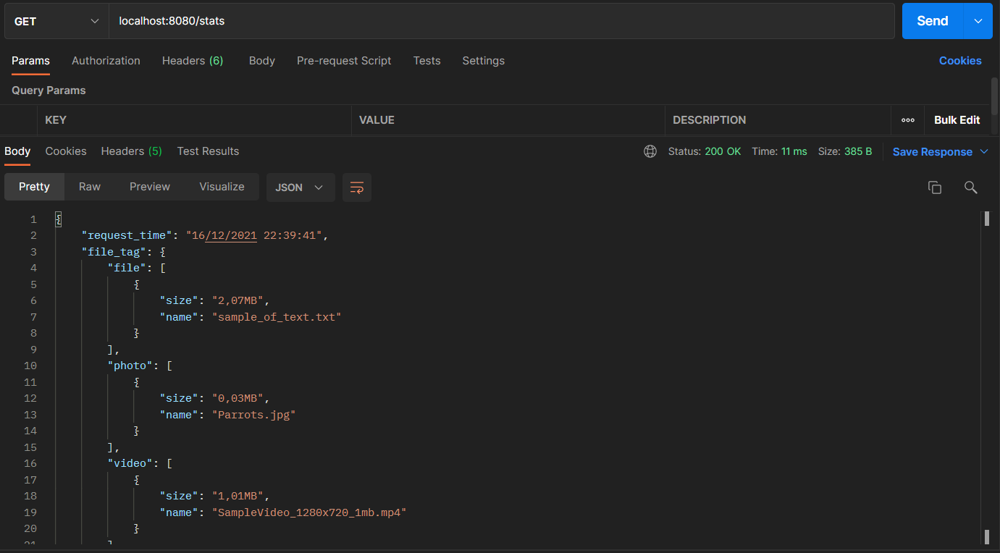
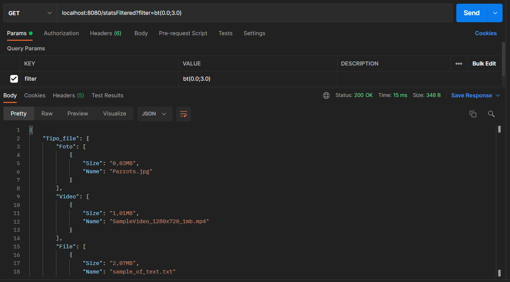

# Progetto Corso POO  


## Indice  :bookmark:
* [Introduzione](#introduzione)  
* [Rotte](#rotte)  
* [Rotte Aggiuntive](#rotte-aggiuntive)
* [Rotte POST](#rotte-post)
* [Rotte GET](#rotte-get)
* [Tecnologie utilizzate](#tecnologie-utilizzate)
* [Autori](#autori)

  
<a name="introduzione"></a>  
## Introduzione :blue_book:


L'applicazione SpringBoot qui pubblicata ha come scopo principale quello di scaricare file dal proprio account Dropbox, 
mediante l'utilizzo della [Dropbox Api V2](https://www.dropbox.com/developers/documentation/http/overview).  

**Funzioni dell'applicazione**:
* Elenco cartelle del proprio account.
* Ottenere informazioni di un file o di una cartella mediante il suo percorso o id univoco.  
* Download di file singoli o cartelle.  
* Ottenere statistiche riguardo i file scaricati(**nome, tipo, dimensione**).  
* Filtrare le statistiche in base alla dimensione.  
  
  
<a name="rotte"></a>
## Rotte :globe_with_meridians: 

| Tipo     | Rotta              | Descrizione                                                      |
|----------|--------------------|------------------------------------------------------------------|
| ` post ` | `/downloadZip`     | Effettua il download di una cartella                             |
| ` post ` | `/downloadFile`       | Effettua il download di un file.                                 |
| ` get `  | `/getList`         | Effettua le statistiche sui file scaricati.                      |
| ` get `  | `/getListFiltered` | Effettua le statistiche sui file scaricati in base al parametro. |
 
<a name="rotte-aggiuntive"></a> 
## Rotte aggiuntive :globe_with_meridians::heavy_plus_sign:
| Tipo     | Rotta              | Descrizione                                                            |
|----------|--------------------|------------------------------------------------------------------------|
| ` post ` | `/getDataPathName` | Restituisce informazioni sul percorso specificato.                     |
| ` post ` | `/getDataId`       | Restituisce informazioni sul file o la cartella specificati.           |
| ` get `  | `/getListMinAvgMax`       | Calcola dimensione minima, media e massima per tipo di file scaricato. |

<a name="rotte-post"></a>
## Rotte POST :arrow_down:

### /downloadZip
#### Chiamata su Postman

La chiamata prende come parametro `path` e il suo valore corrisponde alla cartella che si vuole scaricare, 
nella foto `/Documents`.  

In risposta otteniamo un JSON di questo formato:  
```json
{
    "metadata": {
        "path_display": "/Documents",
        "path_lower": "/documents",
        "name": "Documents",
        ".tag": "folder",
        "id": "id:DsnniHqkdCgAAAAAAAAACQ"
    }
}
```
### /downloadFile
#### Chiamata su Postman

La chiamata prende come parametro `path` e il suo valore corrisponde al percorso del file 
che si vuole scaricare, nella foto `/Images/Parrots.jpg`.

In risposta otteniamo un JSON di questo formato:
```json
{
  "path_display": "/Images/Parrots.jpg",
  "rev": "5d2681c657bb288ff28e1",
  "media_info": {
    "metadata": {
      ".tag": "photo",
      "dimensions": {
        "width": 612,
        "height": 408
      }
    },
    ".tag": "metadata"
  },
  "size": 36454,
  "server_modified": "2021-12-05T15:51:18Z",
  "path_lower": "/images/parrots.jpg",
  "is_downloadable": true,
  "name": "Parrots.jpg",
  ".tag": "file",
  "id": "id:DsnniHqkdCgAAAAAAAAABw",
  "content_hash": "ae63e1a2e4b219e765921f0e5ee2fa32d3f87f55e1eed36b67688ddffc820d2c",
  "client_modified": "2021-12-05T15:51:18Z"
}

```
### /getDataPathName
#### Chiamata su Postman

La chiamata prende come parametro `path` e il suo valore corrisponde al percorso o file di cui 
vogliamo ottenere informazioni, nella foto `/Images/Parrots.jpg`.

In risposta otteniamo un JSON di questo formato:
```json
{
  "path_display": "/Images/Parrots.jpg",
  "rev": "5d2681c657bb288ff28e1",
  "size": 36454,
  "server_modified": "2021-12-05T15:51:18Z",
  "path_lower": "/images/parrots.jpg",
  "is_downloadable": true,
  "name": "Parrots.jpg",
  ".tag": "file",
  "id": "id:DsnniHqkdCgAAAAAAAAABw",
  "content_hash": "ae63e1a2e4b219e765921f0e5ee2fa32d3f87f55e1eed36b67688ddffc820d2c",
  "client_modified": "2021-12-05T15:51:18Z"
}

```
### /getDataId
#### Chiamata su Postman

La chiamata prende come parametro `id` e il suo valore corrisponde all'id univoco del 
percorso o file di cui vogliamo ottenere informazioni, nella foto `DsnniHqkdCgAAAAAAAAACQ`.

In risposta otteniamo un JSON di questo formato:
```json
{
  "path_display": "/Documents",
  "path_lower": "/documents",
  "name": "Documents",
  ".tag": "folder",
  "id": "id:DsnniHqkdCgAAAAAAAAACQ"
}

```  

<a name="rotte-get"></a>
## Rotte GET :arrow_up:
## /getList
### Chiamata su Postman

La chiamata restituisce un JSON dove vengono inseriti, suddivisi per tipologia, i file
scaricati.  
In risposta otteniamo un JSON di questo formato: 
```json
{
    "Tipo_file": {
        "Foto": [
            {
                "Size": "0,03MB",
                "Name": "Parrots.jpg"
            }
        ],
        "Video": [
            {
                "Size": "1,01MB",
                "Name": "SampleVideo_1280x720_1mb.mp4"
            }
        ],
        "File": [
            {
                "Size": "2,07MB",
                "Name": "sample_of_text.txt"
            }
        ]
    }
}
```
## /getListMinAvgMax
### Chiamata su Postman

La chiamata restituisce un JSON dove vengono inseriti i file scaricati divisi per dimensioni 
minime, massime e media dimensioni per tipo di file.  

In risposta otteniamo un JSON di questo formato:
```json
{
  "Tipo_file": {
    "Foto": {
      "Min": {
        "Size": "0,03MB",
        "Name": "Parrots.jpg"
      },
      "Avg": {
        "Size": "0,03MB"
      },
      "Max": {
        "Size": "0,03MB",
        "Name": "Parrots.jpg"
      }
    },
    "Video": {
      "Min": {
        "Size": "1,01MB",
        "Name": "SampleVideo_1280x720_1mb.mp4"
      },
      "Avg": {
        "Size": "1,01MB"
      },
      "Max": {
        "Size": "1,01MB",
        "Name": "SampleVideo_1280x720_1mb.mp4"
      }
    },
    "File": {
      "Min": {
        "Size": "2,07MB",
        "Name": "sample_of_text.txt"
      },
      "Avg": {
        "Size": "2,07MB"
      },
      "Max": {
        "Size": "2,07MB",
        "Name": "sample_of_text.txt"
      }
    }
  }
}
```

## /getListFiltered

La chiamata prende un parametro chiamato `filter` il cui valore viene assegnato come segue:  
  
| Simbolo | Funzione          |
|---------|-------------------|
| `>`     | Maggiore          |
| `<`     | Minore            |
| `>=`    | Maggiore o uguale |
| `<=`    | Minore o uguale   |
| `=`     | Uguale            |
| `bt`    | Compreso          |

Una volta scelto il simbolo per creare il filtro apriamo le parentesi tonde e inseriamo 
la dimensione desiderata, ad esempio: `filter=>(1)` oppure se vogliamo utilizzare un numero con la virgola, 
`filter=>(1.0)`.  
  
Nello specificare la dimensione si possono utilizzare anche i decimi, ad esempio `2.4` o `2,4`. 
  
Nel caso di `bt` oltre alla prima dimensione bisogna aggiungerne un'altra separata dalla prima 
con un punto e virgola `;`, ad esempio: `filter=bt(1;2)` oppure `filter=bt(1.0;1.2)`.

In risposta otteniamo un JSON di questo formato:
```json
{
    "Tipo_file": {
        "Foto": [
            {
                "Size": "0,03MB",
                "Name": "Parrots.jpg"
            }
        ],
        "Video": [
            {
                "Size": "1,01MB",
                "Name": "SampleVideo_1280x720_1mb.mp4"
            }
        ],
        "File": [
            {
                "Size": "2,07MB",
                "Name": "sample_of_text.txt"
            }
        ]
    }
}
```
<a name="tecnologie-utilizzate"></a>
## Tecnologie utilizzate :gear:

Per la realizzazione di questa applicazione sono stati implementati all'interno del 
progetto [SpringBoot](https://spring.io/), [Dropbox Api V2](https://www.dropbox.com/developers/documentation/http/overview) e 
[Dropbox Java SDK](https://www.dropbox.com/developers/documentation/java).

<a name="autori"></a>
## Autori :muscle:

| Nome                                                    | Linkedin                                                            |
|---------------------------------------------------------|---------------------------------------------------------------------|
| [Davide Colabella](https://github.com/Davide-Colabella) | [Linkedin](https://www.linkedin.com/in/davide-colabella-a51017164/) |
| [Matteo Giuliani](https://github.com/GiulianiM)         | [Linkedin](https://www.linkedin.com/in/matteo-giuliani-b552b5221/)  |

